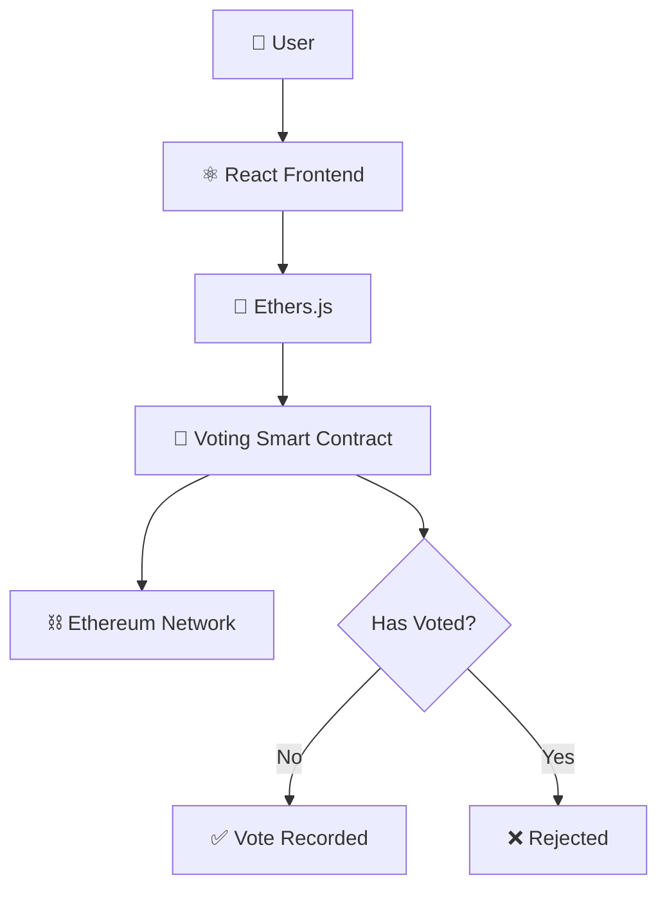

<div align="center">

# 🗳️ Voting DApp

**A transparent, tamper-proof decentralized voting platform powered by smart contracts**


</div>

---

## 📑 Table of Contents

- [Overview](#-overview)
- [Features](#-features)
- [Tech Stack](#-tech-stack)
- [Architecture](#-architecture)
- [Smart Contract Functions](#-smart-contract-functions)
- [Getting Started](#-getting-started)
- [Learning Outcomes](#-learning-outcomes)
- [Future Improvements](#-future-improvements)
- [Author](#-author)

---

## 📖 Overview

**Voting DApp** is a decentralized voting platform built using **Solidity** and **React**. The project demonstrates how blockchain technology can provide transparency, immutability, and trust in digital voting systems.

Users can participate in elections by casting votes directly through smart contracts — ensuring each wallet address can only vote once, with all results verifiable on-chain.

---

## ✨ Features

| Feature | Description |
|---|---|
| 📋 Candidate Registration | Add candidates to the election |
| 🗳️ Cast Votes | Submit a vote tied to your wallet address |
| 📊 View Results | Read live vote counts directly from the contract |
| 🚫 Prevent Double Voting | Each wallet can cast exactly one vote |
| 👛 Wallet Integration | Connect via MetaMask or any injected wallet |
| 🔍 Transparent Vote Counting | All votes are publicly verifiable on-chain |

---

## 🛠 Tech Stack

| Layer | Technologies |
|---|---|
| **Frontend** | React, JavaScript, Ethers.js |
| **Blockchain** | Solidity, Hardhat, Ethereum |

---

## 🏗 Architecture



---

## 📜 Smart Contract Functions

| Function | Type | Description |
|---|---|---|
| `vote()` | Write | Records the caller's vote for a candidate |
| `getCandidates()` | Read | Returns the full list of candidates and vote counts |
| `getWinner()` | Read | Returns the candidate with the most votes |

```solidity
function vote(uint256 _candidateId) public {
    require(!hasVoted[msg.sender], "Already voted");
    hasVoted[msg.sender] = true;
    candidates[_candidateId].voteCount += 1;
}

function getCandidates() public view returns (Candidate[] memory) {
    return candidates;
}

function getWinner() public view returns (string memory winnerName) {
    uint256 highestVotes = 0;
    for (uint256 i = 0; i < candidates.length; i++) {
        if (candidates[i].voteCount > highestVotes) {
            highestVotes = candidates[i].voteCount;
            winnerName = candidates[i].name;
        }
    }
}
```

---

## 🚀 Getting Started

### Prerequisites
- Node.js (v16+)
- MetaMask browser extension
- Hardhat

### Installation

```bash
# Clone the repository
git clone https://github.com/Jeevan9898/voting-dapp.git
cd voting-dapp

# Install dependencies
npm install

# Compile the smart contract
npx hardhat compile

# Start a local blockchain
npx hardhat node

# Deploy the contract
npx hardhat run scripts/deploy.js --network localhost

# Start the frontend
cd frontend
npm install
npm start
```

---

## 🎓 Learning Outcomes

- Smart Contract State Management
- Voting Logic Implementation
- Blockchain Governance Concepts
- Frontend and Smart Contract Integration

---

## 🔮 Future Improvements

- [ ] DAO Governance
- [ ] Proposal Creation
- [ ] Voting Deadlines
- [ ] NFT-Based Voting Rights

---

## 👤 Author

**Jeevan Yadav**

[](https://jeevan-yadav.vercel.app/)
[](https://github.com/Jeevan9898)
